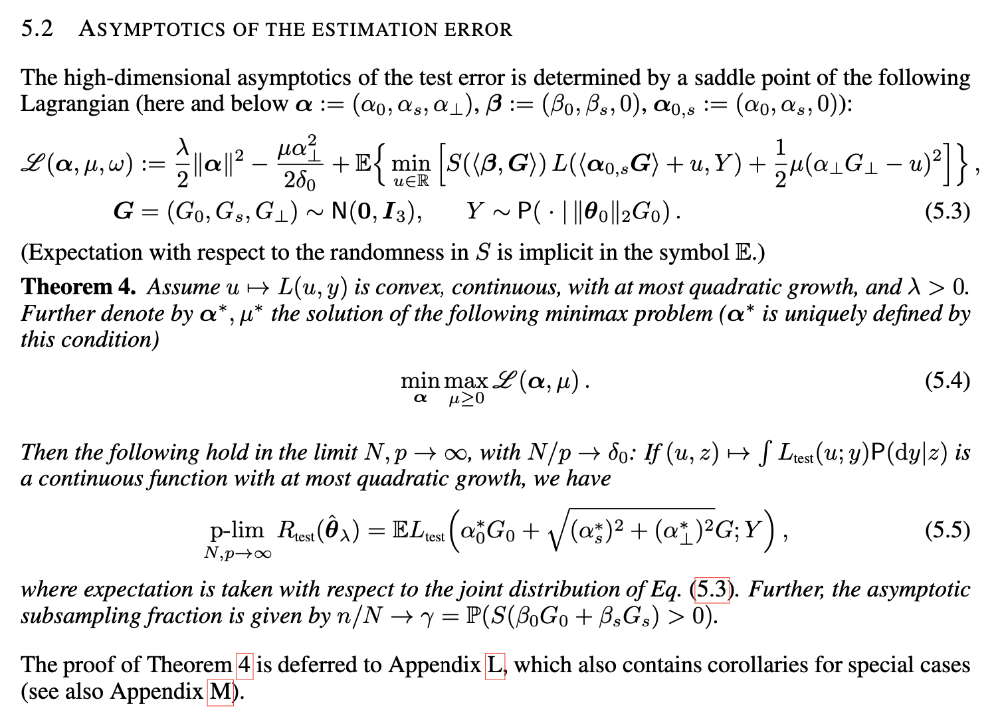
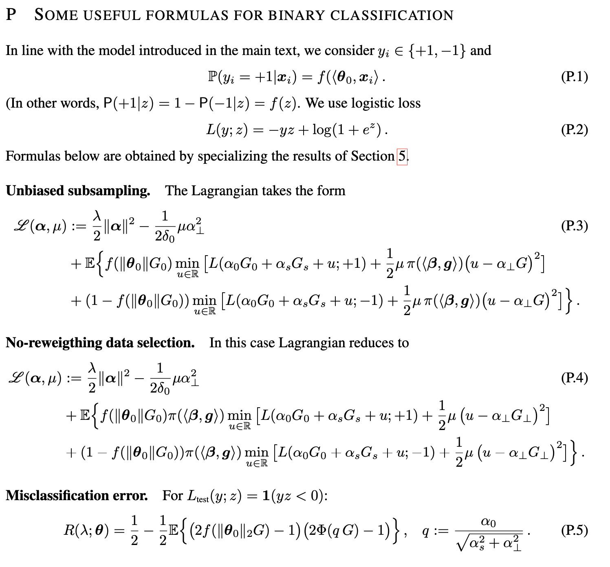

# Towards a statistical theory of data selection under weak supervision [ICLR 2024]

This repo contains the code that solves the theoretical optimization problem `Eq. 5.4` of the `Theorem 4` in the paper:
[Towards a statistical theory of data selection under weak supervision](https://openreview.net/forum?id=HhfcNgQn6p) for
synthetic data as described in the Section 6 "Numerical results: Synthetic data".



Specifically, the code performs theoretical experiments for the special case of binary classification under logistic 
loss for non-reweighting data selection as described in `Appendix P`, "Some useful formulas for binary 
classification", `Eq. P.4`. 



The empirical experiments are also included in the repo for the cases of both non-reweighting and unbiased data 
selection for binary classification under logistic loss. 

The repo contains three main scripts:

- In the case of perfect surrogate model (beta_s=0, alpha_s=0), we solve the problem using `theory2D.py`
- In the case of imperfect surrogate we solve the problem using `theory3D.py`
- The script `isotropic_lr.py` runs the empirical simulations that match the theory

# Requirements

To create the environment, run the following command:
 
```bash
conda env create -n <env_name> -f environment.yml 
```

# Usage

To run the code, ensure appropriate environment is activated:

```bash
conda activate <env_name>
```

Then run the following commands ensuring appropriate configuration are passed in the scripts e.g.:

```bash
python theory2D.py --config configs/config_2D_example.yaml
```

```bash
python theory3D.py --config configs/config_3D_example.yaml
```

```bash
python isotropic_lr.py --config configs/config_synthetic_data_example.yaml
```
